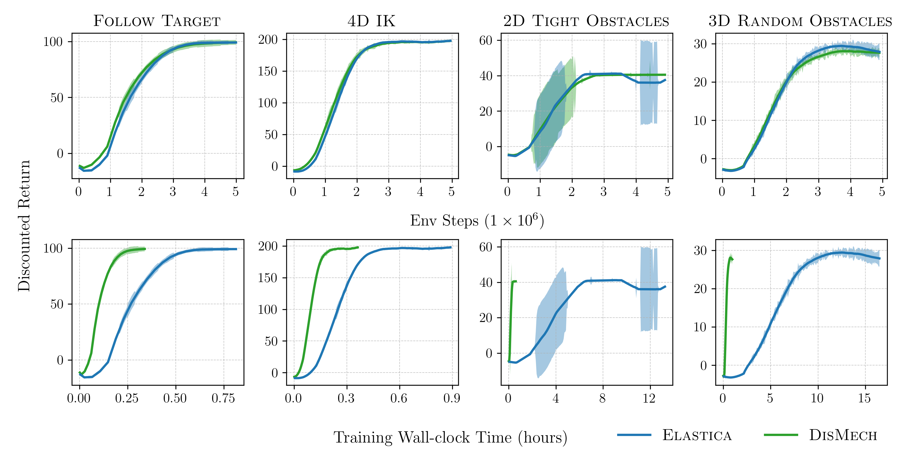

# Rapidly Learning Soft Robot Control via Implicit Time-Stepping

 <div style="text-align: center;">
<p align="center">
  
</p>

 <table align="center">
   <tr>
     <td align="center">    <br>
       <em>Dynamic target following. </em>
       </td>
     <td align="center">    <br>
       <em>Target reaching through 3D obstacles. </em>
     </td>

   </tr>
</table>
</div>

This repo contains code for training various soft manipulator policies using both Elastica and DisMech simulators.
A preprint containing the experiments and results can be found [here](https://arxiv.org/abs/2511.06667).


## Dependencies
To run the code in this repo, two dependencies are needed:
1. [Agent Learning Framework (alf)](https://github.com/HorizonRobotics/alf) for training RL policies.
2. [DisMech](https://github.com/StructuresComp/dismech-rods) for simulating soft-body dynamics.
3. [Elastica](https://github.com/GazzolaLab/PyElastica) (optional) for simulating soft-body dynamics.

To install alf, simply install the repo and pip install as follows. It's recommended to use a `venv`.
```bash
git clone git@github.com:HorizonRobotics/alf.git
cd alf
pip install -e .
pip install pyvista  # for visualizing 3D obstacle task
```
Instructions for installing DisMech can be found in the repo.

Users can also install Elastica if they wish to use it in place of DisMech.
```bash
pip install pyelastica==0.2.4
```
We also provide a docker file with all necessary dependencies that will install `alf`, `py_dismech`, and `pyelastica` packages when built.

***

## Training policies
 <div style="text-align: center;">
<p align="center">
  
</p>
</div>

There are four different soft manipulator tasks that can be trained be specifying the appropriate conf file in `confs/`.

1. Following a target
2. Inverse Kinematics 4D (x, y, z, yaw)
3. 2D Reach through obstacles
4. 3D Reach through obstacles

The simulation framework can be chosen by specifying `--conf_param "sim_framework='{dismech or elastica}'"`.
Below is an example for training the first task with DisMech.

```bash
export OMP_NUM_THREADS=1
python -m alf.bin.train \
    --conf confs/follow_conf.py \
    --root_dir /path/to/root_dir \
    --conf_param "sim_framework='dismech'"
```

Training results can be monitored via `tensorboard`.
```bash
cd /path/to/root_dir
tensorboard --logdir .
```
To save a policy just cancel training with Ctrl+C and press Y to save a checkpoint.

By default, all tasks are trained using SAC with 500 parallel environments. Users interested in using other algorithms can take a look at
`confs/rl_alg_constructor.py`. Note that switching algorithms may require hyperparameter tuning.
Furthermore, all tasks can still be successfully trained with less environments in case 500 parallel environments causes too much contention.
To modify the number of environments to use, users can add the following flag with the above train command
```bash
--conf_param create_environment.num_environments=N
```
For desktop CPUs, we found 100 environments to be a good compromise between experience diversity and computational cost.
***

## Evaluating policies

After training a policy, you can run the latest checkpoint and observe a visualization via
```bash
python -m alf.bin.play \
    --root_dir /path/to/root_dir \
    --conf_param _USER.render=True
```
Users can also compare the sim-to-sim gap between DisMech on Elastica by evaluating a policy trained in one simulation in another.
```bash
python -m alf.bin.play \
    --conf confs/follow_conf.py \  # need to explicitly specify the conf if switching simulators
    --root_dir /path/to/dismech_policy \
    --conf_param _USER.render=True
    --conf_param "sim_framework='elastica'"
```

## Citation
If our work has helped your research, please cite the following preprint.
```
@misc{choi2025rapidlylearningsoftrobot,
      title={Rapidly Learning Soft Robot Control via Implicit Time-Stepping},
      author={Andrew Choi and Dezhong Tong},
      year={2025},
      eprint={2511.06667},
      archivePrefix={arXiv},
      primaryClass={cs.RO},
      url={https://arxiv.org/abs/2511.06667},
}
```
